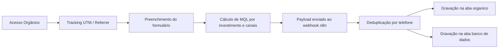

# LP DiagnósticoAds

> Landing page para captação e qualificação de leads para o diagnóstico gratuito de Ads em marketplaces — tráfego orgânico.


🌐 **[Ver página ao vivo](https://diagnosticoads.metodop4.com.br/)** · 📁 **[Repositório GitHub](https://github.com/taysouzaa/DiagnosticoAds)**

README de apresentação para GitHub.

## Visão do Projeto

O **LP DiagnósticoAds** foi construído para capturar e qualificar leads de tráfego orgânico para a sessão de diagnóstico gratuita de Ads do Método P4, conectando conteúdo, coleta de dados e automação em um fluxo único.

### O que o sistema resolve

- Evita perda de lead entre formulário e automação.
- Centraliza captação com validação de dados e qualificação por investimento mensal e canais utilizados.
- Preserva origem de tráfego (UTM e referrer) para análise de canais orgânicos.
- Classifica automaticamente o lead como MQL (qualificado) ou não qualificado.

## O Que Foi Desenvolvido

### 1. Captação e Tracking
- Captura de origem (`channel`, `source`, `medium`, `campaign`, `content`, `referrer`, `page_url`) via script de tracking first-touch.
- Persistência de parâmetros UTM no navegador para reaproveitamento no submit.

### 2. Formulário de Qualificação
- Captura de nome, e-mail, WhatsApp e confirmação.
- Perguntas de qualificação: **investimento mensal em ads** e **canais de marketplace utilizados**.
- Validação local de consistência de telefone (WhatsApp e confirmação).
- Interface responsiva para mobile e desktop.

### 3. Lógica de Qualificação (MQL)
- `MQL = "Sim"` quando: alto investimento mensal **e** canais específicos (sem "outros" genéricos).
- `MQL = "Não"` para leads com baixo investimento ou perfil fora do ideal.
- Campo enviado no payload para o webhook n8n.

### 4. Integração com Automação
- Envio de payload para webhook n8n (`/webhook/Diagnostico-organico`).
- Deduplicação por telefone no n8n antes de gravar na planilha.
- Gravação simultânea na aba **organico** e na aba **banco de dados** do Google Sheets.

### 5. Jornada de Conversão
- Sequência de seções orientada à decisão: hero → benefícios → vídeo → quem somos → FAQ.
- Build otimizado com Vite — output em `dist/` para upload no HostGator.

## Stack Técnica

- **Frontend:** HTML5, CSS3, JavaScript (vanilla + Vite build)
- **Build:** Vite (`vite.config.ts`)
- **Integração:** Webhook n8n (direto, sem proxy)
- **SEO:** `sitemap.xml`, `robots.txt`
- **Deploy:** HostGator/cPanel — upload manual do conteúdo de `dist/`

## Arquitetura (Resumo)

| Camada | Responsabilidade |
| --- | --- |
| `ads.html` | LP principal (fonte de desenvolvimento) |
| `dist/` | Build gerado pelo Vite — conteúdo para upload |
| `assets/` | Imagens e ícones da LP |
| `fonts/static/` | Fontes Sora utilizadas no build |
| `public/` | Arquivos estáticos copiados direto para `dist/` |
| `docs/` | Workflows n8n, scripts e documentação técnica |
| `TECNICO.md` | Guia técnico de manutenção |

## Funcionamento do Sistema

1. Usuário acessa a LP via canal orgânico (busca, redes sociais, indicação).
2. Tracking first-touch inicializa e persiste UTMs.
3. Usuário preenche formulário com dados e informações de investimento.
4. Aplicação calcula MQL e monta payload com dados + tracking.
5. Payload é enviado para o webhook n8n.
6. n8n deduplica por telefone consultando o banco de dados.
7. Lead é gravado nas abas **organico** e **banco de dados** do Google Sheets.



## Diferenciais de Engenharia

- Tracking first-touch desacoplado da lógica de formulário.
- Qualificação multivariável calculada no frontend (investimento + canais).
- Deduplicação server-side no n8n para evitar leads duplicados.
- Pipeline de build com Vite para versão otimizada de produção.

## Estrutura do Projeto

```text
.
├─ assets/
│  ├─ 01.png
│  ├─ 03.png
│  ├─ equipe-p4.jpg
│  ├─ equipe-p4-reuniao.jpg
│  └─ video-thumb-diagnostico.webp
├─ docs/
│  ├─ n8n-diagnostico-organico.json
│  ├─ n8n-workflow-diagnostico-organico.json
│  ├─ PADRAO-AUTOMACAO-TRACKING.md
│  ├─ PADRAO-SEO.md
│  ├─ relatorio.md
│  ├─ setup-banco-de-dados.gs
│  └─ setup-organico.gs
├─ fonts/
│  └─ static/
│     ├─ Sora-Bold.ttf
│     ├─ Sora-ExtraBold.ttf
│     ├─ Sora-Light.ttf
│     ├─ Sora-Medium.ttf
│     ├─ Sora-Regular.ttf
│     └─ Sora-SemiBold.ttf
├─ public/
│  ├─ htaccess-hostgator.txt
│  ├─ robots.txt
│  └─ sitemap.xml
├─ ads.html
├─ package.json
├─ vite.config.ts
├─ TECNICO.md
└─ LICENSE
```

## Build

```bash
npm install
npm run build
```

## Deploy

- **HostGator/cPanel:** upload manual do conteúdo de `dist/` via Gerenciador de Arquivos ou FTP.

## Licença

A licença **permanece inalterada** e segue os termos proprietários definidos em [LICENSE](./LICENSE).
